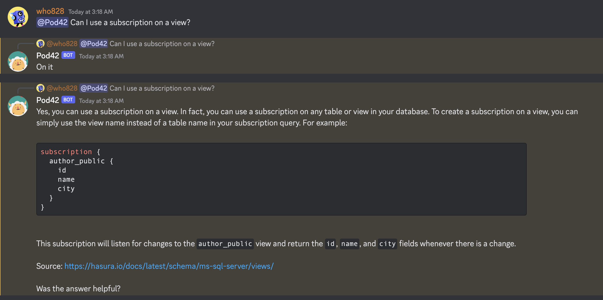
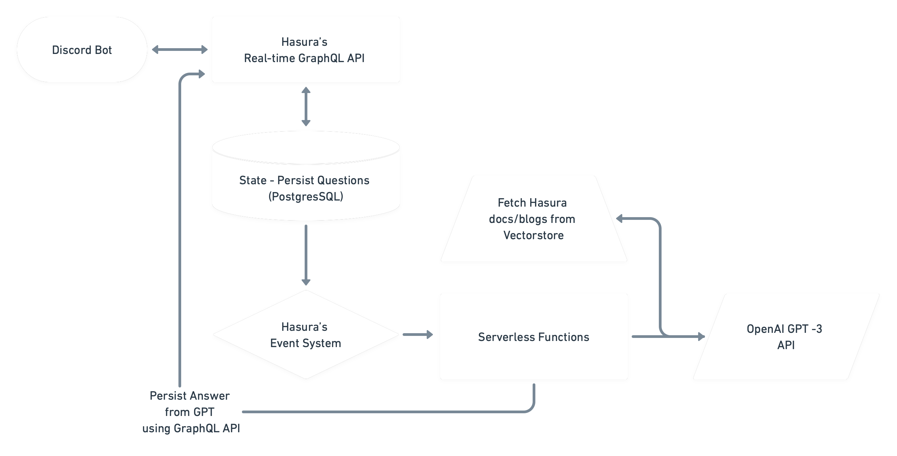
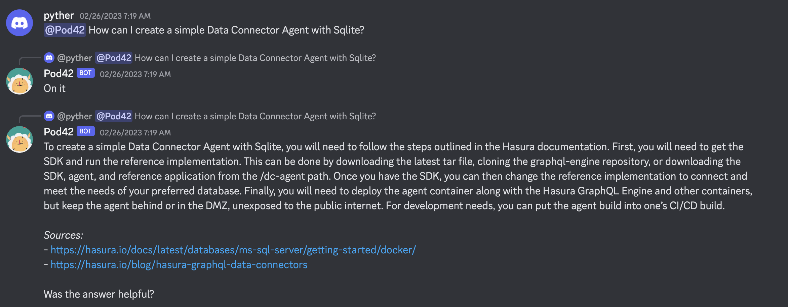
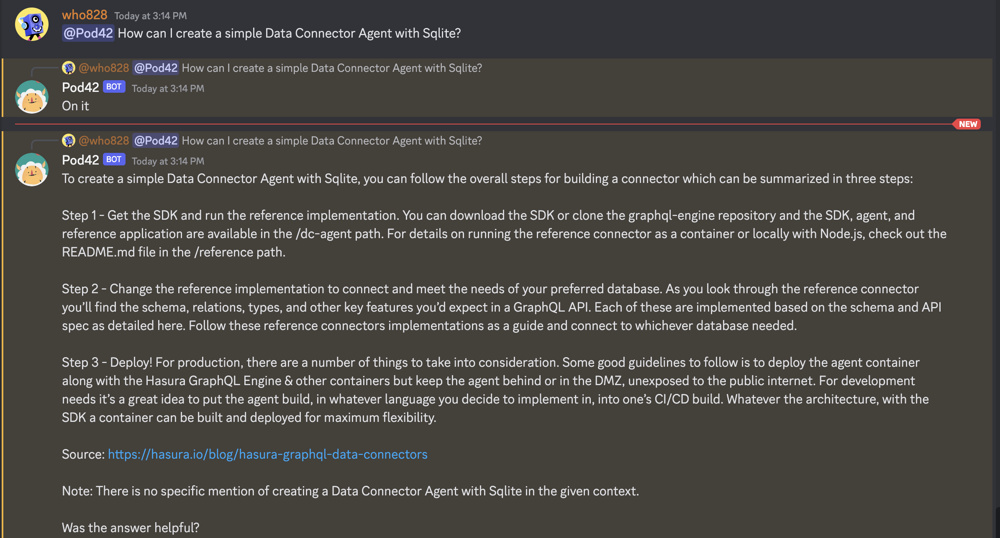
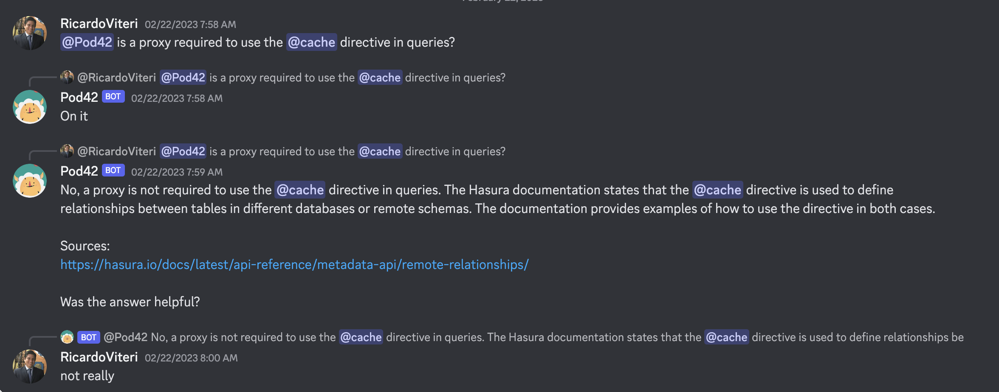
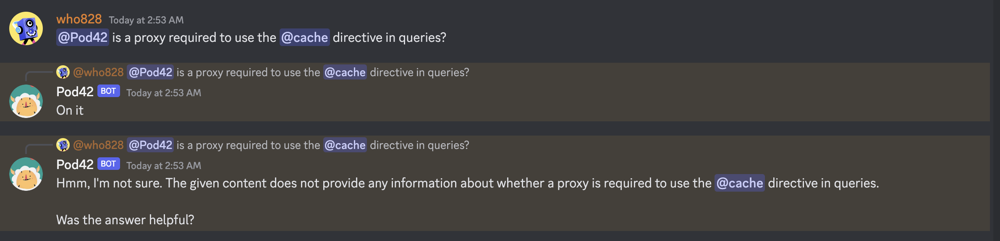
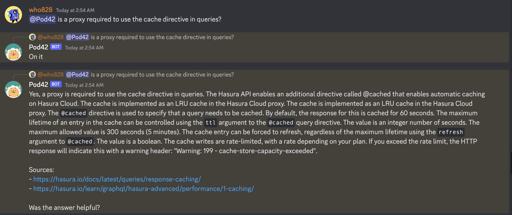

# hasura-pod42

A Discord bot to answer questions based on docs using the latest ChatGPT API, built on [Hasura GraphQL
Engine](https://github.com/hasura/graphql-engine) and [LangChain](https://github.com/hwchase17/langchain).

You can try the bot on our [Discord](https://discord.gg/hasura), read more about the annoucement [here.](https://hasura.io/blog/announcing-pod42-the-hasura-chatgpt-bot/)

Its features include:
- Asynchronous architecture based on the Hasura events system with rate limiting and retries.
- Performant Discord bot built on Hasura's streaming subscriptions.
- Ability to ingest your content to the bot.
- Prompt to make GPT-3 answer with sources while minimizing bogus answers.

Made with :heart: by <a href="https://hasura.io">Hasura</a>

----------------
## Motivation

We at Hasura always believe that we are better at caring for plumbing so they can focus on their core problems. Hence, when `text-davinci-003` came out, we saw an opportunity to resolve our user's query on Discord.

We had the following objectives when creating the bot,
- Use Hasura's docs/blogs/learning courses.
- Always list sources when answering.
- Better to say "I don't know" over an incorrect answer.
- Capture user feedback and iterate quickly.

----------------

## Table of contents
- [Installation](#installation)
  * [Setup Hasura Pod42](#steps-to-setup-hasura-pod42)
- [Architecture](#architecture)
- [Comparison: text-davinci-003 vs gpt-3.5-turbo](#comparison-text-davinci-003-vs-gpt-35-turbo)

## Installation

### Steps to Setup Hasura Pod42

- Setup [pod42-server](https://github.com/hasura/pod42/tree/main/src/pod42-server)
- You can use the one-click to deploy on Hasura Cloud to get started quickly:
  
  

## Architecture

Pod42 is based on [3-factor architecture](https://3factor.app)

### Discord Bot:
- Uses real-time GraphQL API from Hasura.
- Minimal state and code.
- Instant feedback.
- Easily Scalable.

Tasks:
- Collect questions from users and persist them via Hasura's GraphQL API.
- Listen for answers in real-time using subscriptions.

### Hasura:
- Completely asynchronous orchestrator using event triggers and subscriptions.
- Event triggers handle retry and rate limit to webhook.
- Subscriptions allow us to deliver instant answers to the Discord bot.

Tasks:
- Trigger workflow when a new question comes.
- When the Answer arrives, notify the clients through subscription.

### Serverless Functions/Containers:
- Stateless easily be deployed as a function on the cloud.

Tasks:
- Fetch top K-related docs excerpts from the vector store.
- Combine them in one document along with the question to OpenAI.
- Persist the answer using Hasura's GraphQL API.

## Comparison: text-davinci-003 vs gpt-3.5-turbo

For Hasura's use case, we want to emphasize the correctness of the answers; it's better for us if Pod42 says "I Don't Know" instead of bluffing an answer.

### Example: When the answer exists in Docs
**text-davinci-003**:

**gpt-3.5-turbo**:

### Example: When Question is Misunderstood
**text-davinci-003**:

The above answer is entirely false; it misunderstood the question as Discord passed a user-id instead of the text `@Cache`.

**gpt-3.5-turbo**:

The above is a much better answer; it might prompt the user to ask the question better and at which point you get the following outcome.

**gpt-3.5-turbo**:

---
Maintained with :heart: by <a href="https://hasura.io">Hasura</a>

